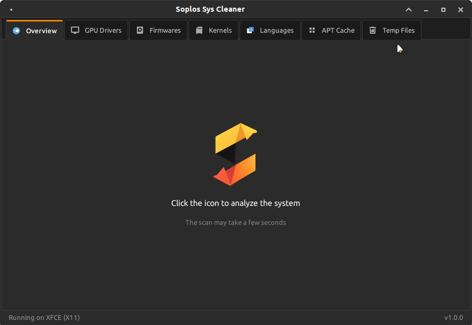
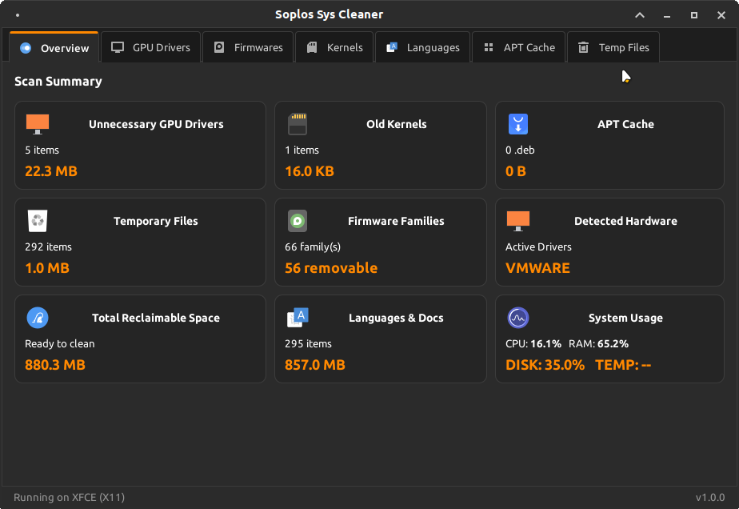
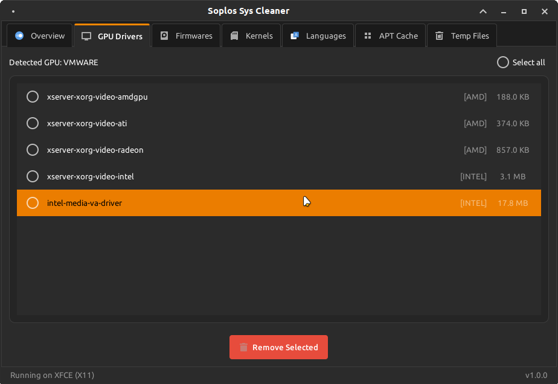
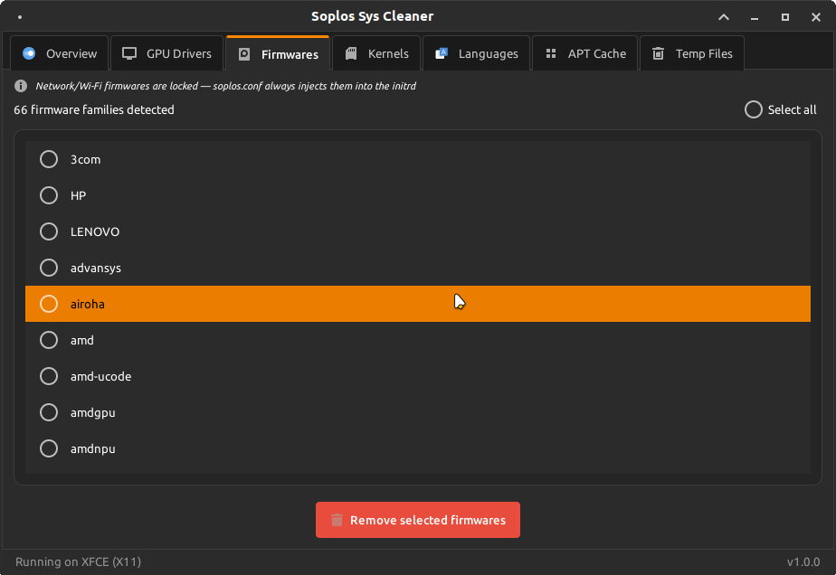
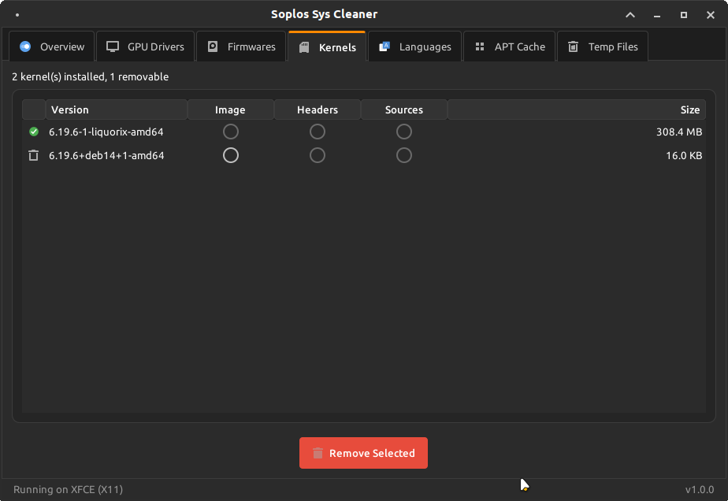
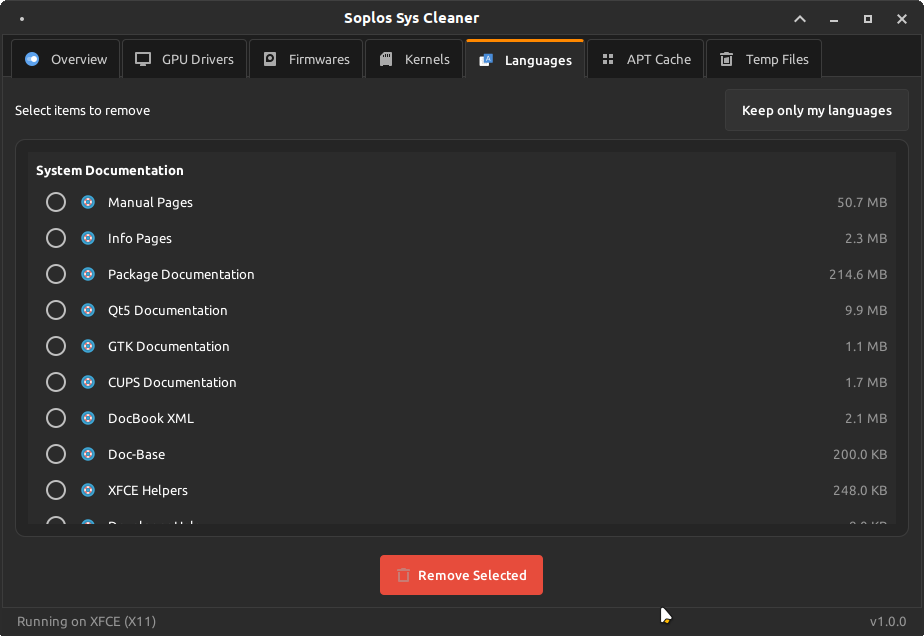
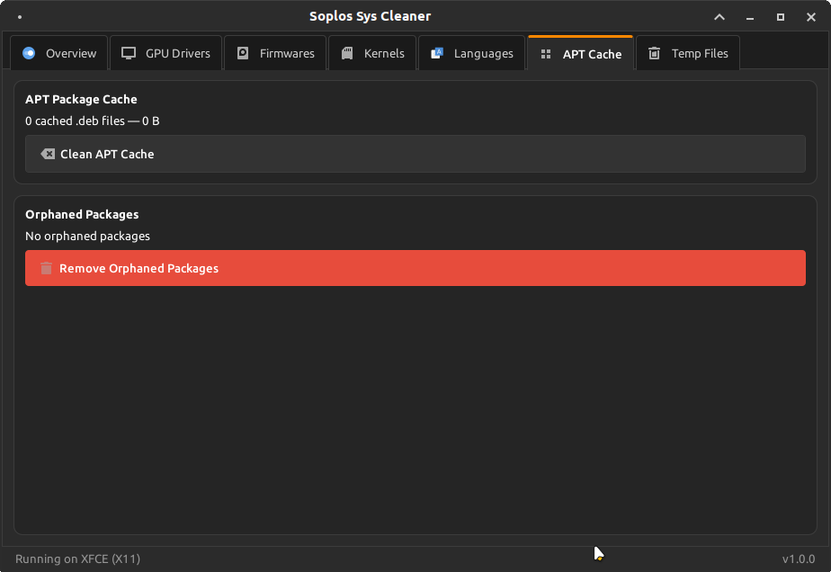
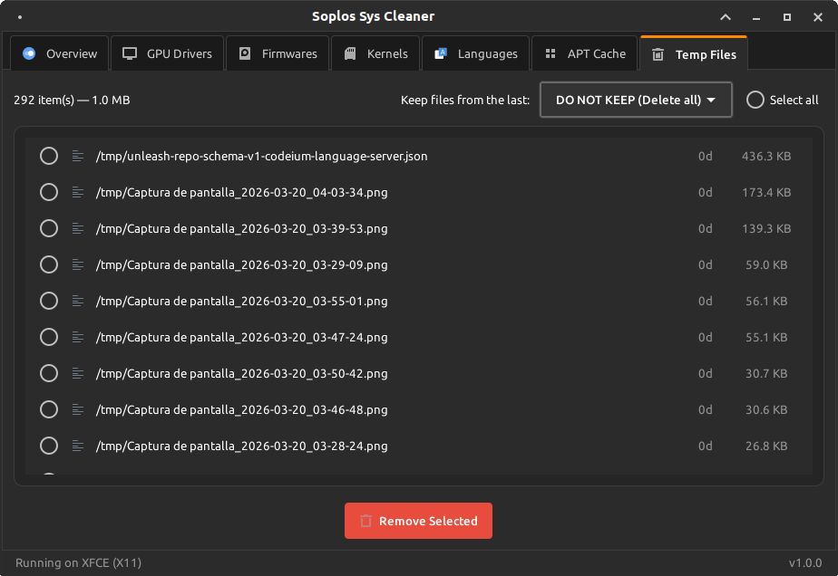

# Soplos Sys Cleaner

[](https://www.gnu.org/licenses/gpl-3.0)
[]()

A system cleaning and optimization utility designed specifically for Soplos Linux.

## 📝 Description

Soplos Sys Cleaner is an advanced system maintenance tool for Soplos Linux distributions (like Boro, Tyron, and Tyson). It safely removes unnecessary files, clears cache, uninstalls old kernels, and optimizes the system while utilizing `dracut.conf.d/soplos.conf` for initramfs integration.

## ✨ Features

- **System Summary**: View at a glance your Soplos variant, active kernel, session type, and uptime.
- **Smart Cleanup of Temporary Files**: 
  - `apt` cache and lists
  - User and root `~/.cache`
  - System logs (`/var/log`)
  - Crash reports
  - `__pycache__` directories automatically detected and cleaned
- **Dual-Layer Scanning**: Separate fast User-level scans and deep Root-level scans to eliminate intrusive password prompts.
- **Disk Space Optimization**: Removes unnecessary packages (`apt autoremove --purge`) and cleans up Flatpak unused runtimes and caches.
- **User Space Management**: Safely empty User Trash and application caches without needing administrative privileges.
- **Old Kernel Removal**: Intelligently identifies and removes old kernels to free up boot partition space, integrating directly with Soplos's system tools.
- **Resource Monitoring**: Tracks CPU usage, RAM utilization, Disk usage, Temperature, and GPU details intuitively.
- **Selective Languages & Docs Cleanup**: Advanced scanner that protects your system locale while allowing removal of unused translations and help files for Gnome, KDE, and XFCE.
- **Smart Selection**: Quickly keep only your active languages and English, marking everything else for deletion.
- **Consolidated Security**: Single password prompt (`pkexec`) for complex cleaning tasks.
- **Slim Modern UI**: Implements Soplos Standard v2.0 with slim tabs and Gtk.HeaderBar matching WebApp Manager.
- **Hardware Protection**: Prevents removal of critical network firmwares and active kernels.
- **Automatic Refresh**: Instant UI updates after cleaning operations.
- **Universal Scanning**: Deep scan of over 15 critical system paths tailored for Boro, Tyron, and Tyson.
- **One-Click Maintenance**: Cleans everything or just specific sections.
- **Desktop Environment Agnostic**: Designed to fit seamlessly into Soplos distributions running GNOME, KDE Plasma, or XFCE using native-looking GTK interfaces.

## 📸 Screenshots

| Welcome Screen | Scan Summary |
| :---: | :---: |
|  |  |

| GPU Drivers | Firmwares |
| :---: | :---: |
|  |  |

| Kernels | Languages & Docs |
| :---: | :---: |
|  |  |

| APT Cache | Temp Files |
| :---: | :---: |
|  |  |

## 🔧 Installation

```bash
# Installation instructions
sudo apt install soplos-sys-cleaner
```

## 🌐 Supported Languages

- 🇪🇸 Spanish (Español)
- 🇬🇧 English
- 🇫🇷 French (Français)
- 🇵🇹 Portuguese (Português)
- 🇩🇪 German (Deutsch)
- 🇮🇹 Italian (Italiano)
- 🇷🇺 Russian (Русский)
- 🇷🇴 Romanian (Română)

## 📄 License

This project is licensed under [GPL-3.0+](https://www.gnu.org/licenses/gpl-3.0.html) (GNU General Public License version 3 or later).

This license guarantees the following freedoms:
- The freedom to use the program for any purpose
- The freedom to study how the program works and modify it
- The freedom to distribute copies of the program
- The freedom to improve the program and publish those improvements

Any derivative work must be distributed under the same license (GPL-3.0+).

For more details, see the LICENSE file or visit [gnu.org/licenses/gpl-3.0](https://www.gnu.org/licenses/gpl-3.0.html).

## 👤 Developer

Developed by Sergi Perich  
Website: https://soplos.org  
Contact: info@soploslinux.com

## 🔗 Links

- [Website](https://soplos.org)
- [Report issues](https://github.com/SoplosLinux/soplos-sys-cleaner/issues)
- [Help](https://soplos.org)

## 📦 Versions

### v1.0.1 (25/03/2026)
- Major Architecture Update: Introduced Dual-Layer Scanning (User vs Root modes) to prevent unnecessary password prompts on startup.
- Added Flatpak unused runtimes cleaning.
- Added specific User Cache (`~/.cache`) and Trash cleanup tabs working without root privileges.
- Dynamic UI tabs that reveal administrative features only after explicit root authorization.
- Fixed repeated `pkexec` password prompts when refreshing UI after cleanup tasks.
- Fixed Kernels tab appearing empty due to IPC data mapping errors.
- Fixed redundant root authentication loops when the application is launched via `sudo`.

### v1.0.0-2 (20/03/2026)
- Fixed: About dialog credits panel on KDE now displays with an opaque dark background and square corners instead of transparent or rounded-corner artifacts.
- About dialog app icon standardized to 48×48 pixels.

### v1.0.0-1 (20/03/2026)
- Added keyboard shortcuts Ctrl+Tab / Ctrl+Shift+Tab to cycle between tabs.
- Added F1 shortcut to open the About dialog.
- Fixed: GNOME HeaderBar now displays with correct dark background matching other Soplos apps.
- Fixed: GNOME CSD window controls (minimize/maximize/close) no longer styled by the global button CSS.

### v1.0.0 (20/03/2026)
- Initial release with Soplos v2.0 Standard Architecture.
- New "Languages & Docs" tab with intelligent locale protection (Gnome/KDE/XFCE support).
- Professional HeaderBar replication mirroring WebApp Manager (Buttons flat and titlebar class).
- Slim and modern tab UI (Soplos Standard v2.0) with custom padding and smaller icons.
- Consolidated `pkexec` prompts for unified administrative tasks.
- Recursive `__pycache__` cleaning support.
- Extended hardware monitoring (Temperature, GPU, Disk).
- Forced network firmware protection to prevent boot issues.
- Precise disk usage calculation using `du -sk`.
- Universal scanner covering over 15 critical system paths.
- Default window size optimized to 920x600.
- Full UI translation in 8 languages (ES, EN, FR, DE, PT, IT, RO, RU).
- Added keyboard shortcuts: Ctrl+W (close), Ctrl+R (rescan), Ctrl+1–7 (tab navigation).
- Scan icon in Overview tab enlarged to 128px.
- Fixed: action buttons now re-enable after failed or cancelled operations.
- Fixed: progress bar now closes after kernel cleanup completes.
- Fixed: translatable strings in GPU Drivers and Firmware tabs corrected to English.
- Fixed: socket files and symlinks (D-Bus, MCP) excluded from Temp Files scanner.
- Fixed: temp file deletion now uses `pkexec` fallback for root-owned files.
- Fixed: APT Cache scanner now includes package lists size (`/var/lib/apt/lists/`).
- Fixed: "Remove orphaned packages" button hidden when no orphans are present.
- Fixed: Languages tab uses lazy loading — widgets created only when tab is opened, eliminating post-scan UI freeze.
- Fixed: system usage metrics timer moved to background thread to prevent interaction lag.
- Improved: `fmt_size()` consolidated in `utils/constants.py`, eliminating duplication across 6 files.
- Improved: duplicate constants and unused functions removed.
- Improved: Overview card strings fully translatable in all 8 languages.
